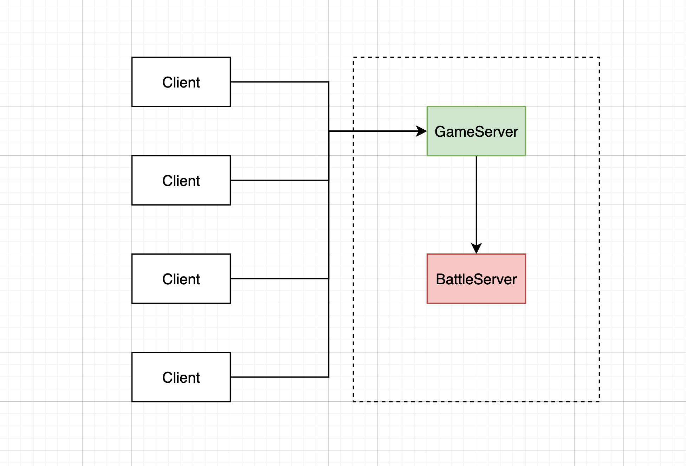
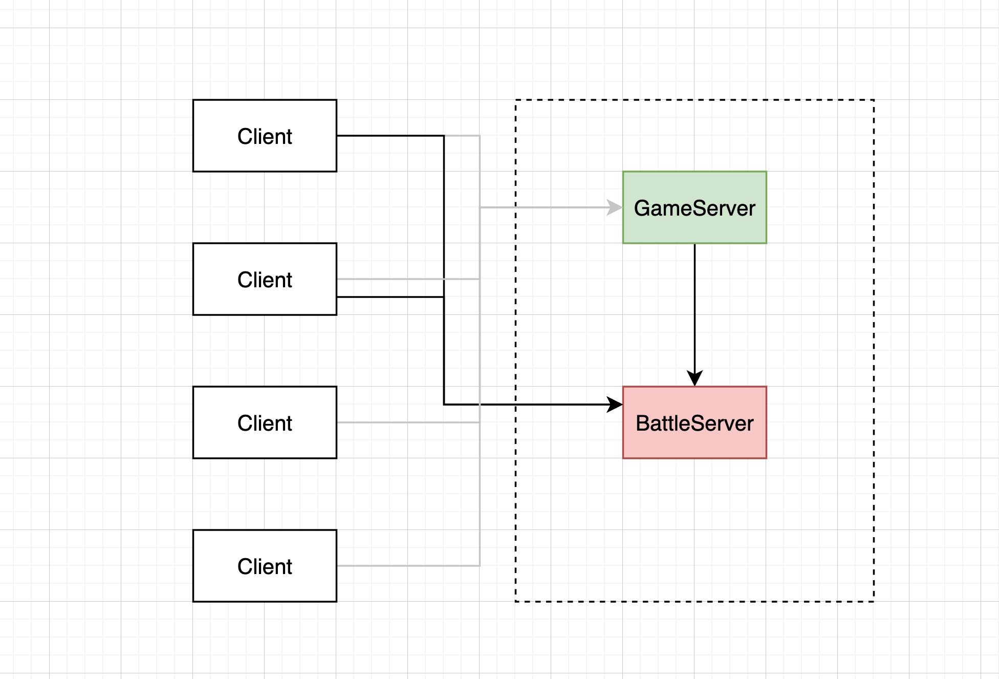

# .Net 分散式遊戲伺服器
## 基本介紹
這是一個使用.Net 6開發的分散式遊戲伺服器，客戶端使用Unity遊戲引擎開發的一對一貪食蛇遊戲。
## 演示

## 客戶端專案 GitHub
[點此前往](https://github.com/lin900822/LittleOnlineGame)
## 使用技術
- .Net 6 + Socket
- MySQL
- Protobuf
## Server架構與配對流程
目前有兩個Server，GameServer與BattleServer。
- GameServer：處理遊戲登入、註冊、配對玩家比賽等邏輯。
- BattleServer：處理玩家比賽配對成功後，進入房間內的戰鬥邏輯（如蛇的移動、吃食物變長、碰撞等）。
客戶端開啟後，會自動連上GameServer。

玩家登入並按下配對按鈕後，會進入GameServer的配對Queue，當有兩個（或以上）玩家正在配對中，GameServer會將此二玩家的Id傳至BattleServer請求開啟新房間，請求成功後BattleServer會響應加入房間的Key給GameServer，GameServer再廣播給配對成功的兩名玩家，最後客戶端會透過此Key向BattleServer發送加入房間請求，當BattleServer收到兩位玩家的請求並驗證成功後，即可開始遊戲。
